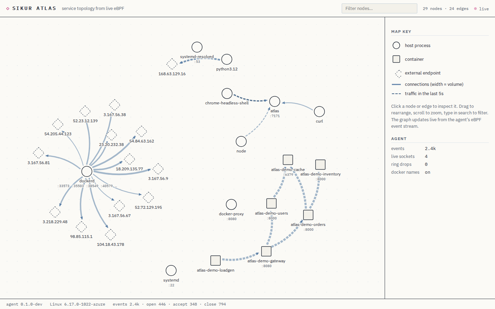

# Sikur Atlas

Atlas draws a live map of which services on a Linux machine talk to each
other, from real kernel events — and remembers it. Scrub backwards
through time, compare two moments, and see exactly what changed: which
service disappeared, which dependency appeared, where failures and
latency moved. No instrumentation, no sidecars, no Prometheus, no
config.

It traces TCP connection lifecycles with eBPF (stable tracepoints plus
one kretprobe), attributes each connection end to a process or Docker
container, groups containers into their Compose services, and records
everything into a local SQLite file so the topology has a past, not just
a present.



## Quick start

Requirements: Linux kernel ≥ 5.8 with BTF (`/sys/kernel/btf/vmlinux`
exists — true for all mainstream distro kernels), root or
`CAP_BPF`+`CAP_PERFMON`, Go ≥ 1.25, Node ≥ 20, clang.

```bash
make build          # compiles the eBPF object, the web UI and the agent
sudo ./bin/atlas    # serves http://localhost:7171
```

Every TCP connection opened from now on shows up within about a second.
`curl example.com` gives you your first edge. History lands in
`/var/lib/sikur-atlas/history.db` (`--db` to move it).

### The demo topology

`demo/` contains a six-service workload (nginx gateway, two Python APIs,
an inventory service, Redis, a load generator) that Atlas discovers from
its actual traffic:

```bash
make demo-up        # docker compose; unmodified public images, no builds
```

Within ~30 seconds the Services view shows
`loadgen → gateway → {orders, users}`, `orders → {inventory, cache}` and
`users → cache`, with connection counts, RTT and byte totals on every
edge. One deliberate defect is included: `users` tries `cache:6380` on
every request, where nothing listens — so you can see what a failing
dependency looks like (red edge, failure and reset counts) from real
refused connections.

Now break something and watch Atlas remember:

```bash
docker compose -f demo/docker-compose.yml stop inventory
# wait a couple of minutes, then in the UI:
#   - scrub the timeline back: inventory is there in the past
#   - "Pin A" on a past moment, pick a present moment: Compare lists
#     "− inventory" and "− orders → inventory:8000"
```

`make demo-down` removes the workload. `make e2e` runs this whole story
non-interactively — including a real service stop, an agent restart to
prove history survives, and a headless-browser pass over live view,
Replay, Compare, Focus and filtering (CI does this on every push).

## What you see

- **Services view** (default): containers grouped by Docker Compose
  service, host processes grouped by executable, well-known
  infrastructure (dockerd, systemd, sshd, …) and Atlas itself hidden
  behind a "system" toggle, external endpoints collapsed into one node.
  **Raw view**: every process, container and endpoint, ungrouped.
- **Overview layout**: a directed left-to-right dependency layout.
  **Explore**: free-form force layout you can drag.
- **Edges** carry health from kernel evidence: connection rate, active
  connections, failed connects, RSTs received, retransmitted segments,
  smoothed RTT (handshake and close samples), bytes on close.
- **Timeline + Replay**: the strip at the bottom shows recorded
  activity; click to view the topology as it stood at that moment.
  **Compare** pins moment A against moment B and lists added/removed
  services and edges plus meaningful health changes — computed from
  recorded evidence with fixed thresholds, never guessed.
- **Focus** dims everything outside a service's transitive callers and
  dependencies (its blast radius).

Retention: 10-second buckets for 2 hours, 5-minute buckets for 7 days,
in one local SQLite file. See
[docs/architecture.md](docs/architecture.md) for the exact semantics of
every metric, the reconstruction windows, and the known limitations
(connections that predate the agent, metrics only measurable at close,
IPv4/IPv6 scope, and friends).

## Privileges and privacy

The agent loads read-only BPF programs on stable tracepoints
(`sock:inet_sock_set_state`, `tcp:tcp_retransmit_skb`,
`tcp:tcp_receive_reset`) and a kretprobe on `inet_csk_accept`, and reads
`/proc` for process metadata. That needs root, or `CAP_BPF`+`CAP_PERFMON`
on recent kernels. It never reads packet payloads; events carry
addresses, ports, pids, comm names, byte counts and RTT estimates only.
The API listens on `127.0.0.1` by default and has no authentication —
do not expose it beyond localhost.

## Development

```bash
make verify   # deterministic gate: bpf build, vet, golangci-lint,
              # go test, tsc, eslint, vitest, UI build, agent build
make e2e      # full end-to-end incl. replay/compare/restart (Linux)
make bpf      # just the eBPF object (clang; BPF_CC="zig cc" works too)
```

The Go tests run on any OS — including the history store (pure-Go
SQLite) and a validation of the compiled BPF object's BTF against the Go
event decoder. Everything kernel-dependent is verified in CI on a real
kernel by `make e2e`.

Layout: `bpf/` C programs, `internal/ebpf` loading and decoding,
`internal/collector` connection correlation, `internal/graph` the live
store, `internal/history` the SQLite history behind Replay/Compare,
`internal/appview` the service-level projection and diff, `internal/api`
HTTP/SSE, `web/` the React UI, `demo/` the workload, `scripts/` the e2e
harness.

## License

Apache-2.0. Vendored BPF helper headers in `bpf/include/` are
BSD-2-Clause (from libbpf via cilium/ebpf); IBM Plex fonts in
`web/public/fonts/` are OFL-1.1.
